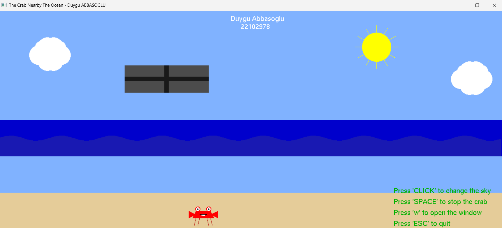
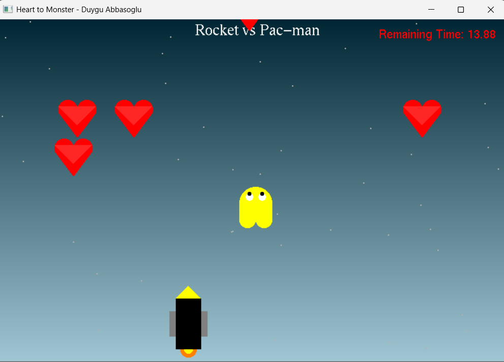

# CTIS164

This repository contains interactive OpenGL projects 
developed for the Technical Mathematics with Coding course.

## **1. The Crab Nearby The Ocean**
Simulates a seaside environment with the moving crab, Rıfkı and 
interactive day-night transitions.

### Features
- Move the crab (`SPACE` to stop).
- Toggle day/night with `CLICK`.
- Open/close the window (`w` key).
- Exit with `ESC`.

## **2. Heart to Monster**
A shooting game where the player collects points 
by hitting hearts and avoiding monsters.

### Features
- Move the rocket with `A/D` or arrow keys.
- Shoot bullets with `SPACE`.
- Reset with `r`, exit with `ESC`.
- Uses the custom **vector library** in the `lib` folder.

### How to Run
Open the `.sln` file for each project in Visual Studio, 
build, and run to explore the interactive features.
